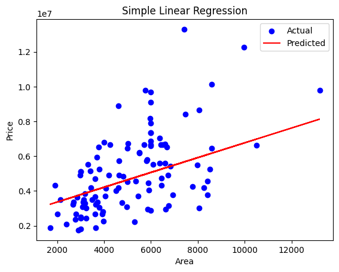

# 🏡 Task 3: Linear Regression on Housing Price Dataset

This project demonstrates the use of **Simple and Multiple Linear Regression** on a housing price dataset using Python and scikit-learn. It was completed as part of my internship at Elevate Labs.

---

## 📁 Dataset
- Source: [Kaggle Housing Price Dataset](https://www.kaggle.com/datasets/harishkumardatalab/housing-price-prediction)
- File used: `Housing.csv` (cleaned before modeling)

---

## 📌 Key Steps
1. Imported and preprocessed the dataset
2. Split data into train/test sets
3. Built linear regression models (simple + multiple)
4. Evaluated performance using MAE, MSE, and R²
5. Visualized results

---

## 📊 Models Implemented

### 🔹 Simple Linear Regression
- Feature: `area`
- Target: `price`
- Evaluation: MAE, MSE, R²
- 📈 Visualization: Regression line

### 🔹 Multiple Linear Regression
- Features: All except `price`
- Target: `price`
- 📈 Visualization: Predicted vs Actual scatter plot

---

## 📸 Visualizations

### Simple Regression (area vs price)

### Predicted vs Actual Prices (Multiple Regression)

---

## 🧠 Interview Preparation (Bonus Section)

1. What assumptions does linear regression make?
2. How do you interpret the coefficients?
3. What is R² score and why is it important?
4. MAE vs MSE – when to use which?
5. How do you detect multicollinearity?
6. Can linear regression be used for classification?

---

## 🛠 Tech Stack

- Python 3.9+
- Jupyter Notebook
- pandas, seaborn, matplotlib
- scikit-learn

---

## 📂 Files Included

task-3-housing-regression/
├── Housing.csv
├── Cleaned_Housing.csv (optional)
├── Task_3_Housing_Linear_Regression.ipynb
├── predicted-vs-actual.png
├── simple-regression.png
└── README.md

---

## 👨‍💻 Author

**Manish Kumar Srivastav**  
📧 msivastavmanish@gmail.com 
🔗 [LinkedIn](https://www.linkedin.com/in/manish-kumar-srivastav)  
🐙 [GitHub](https://github.com/Roxtop07)
